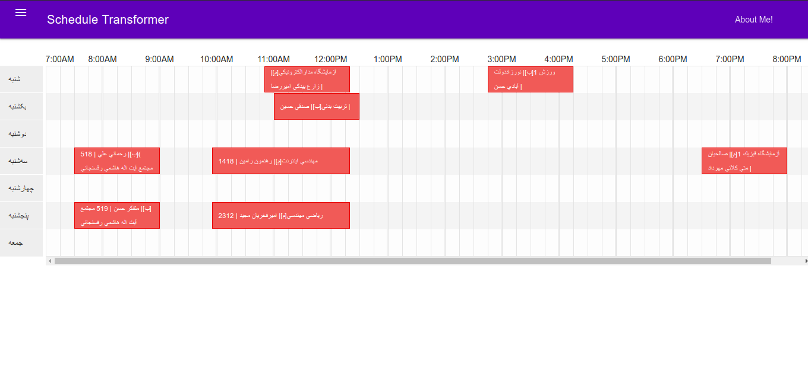

# Introduction
Schedule Transformer is a hobby project of mine which can be useful for my fellow students at IAUCTB to get a good timetable view of their weekly schdeule of the classes they've taken in the present semester.
## Usage
Pretty Simple; You save the contents you get at `stu.iauctb.ac.ir/program_hafteh2.aspx` as an `*.html` file, then go to [latest production version](https://transformer-taravati.fandogh.cloud) which I've deployed on [Fandogh PaaS](http://fandogh.cloud) or your own deployment, upload the file and click the button. If the file is valid, and hopefully its structure hasn't been changed recently in a way that triggers a failure, you get your timetable right away.

## Screenshot

## Missing Features
* Print Preview
* Mobile Friendliness
* Load/Save Functionality
* Add Extra Events Manually

## Contributions
Contributions are very much welcome!

# Technical Specifications
## Dependencies
As mentioned in `package.json`

## Application Workflow
* `server.js` is run by node.
* The application starts listening for GET requests for `/` and POSTS requests for `/upload` on port 8080.
* Requests for `/static` are handled by `express.static`.
* We are going to use docker. We'll be mapping the host machine's port of our desire to port 8080 on our container. on fandogh it will be mapped to default HTTP and HTTPS ports.
* You GET the index.html page which contains a browse and an upload button.
* You browse and select an html file which is the saved file of 'program_hafteh2.aspx'
* The file is POSTed in an AJAX call.
* A JSON array of courses is returned as response.
* upload form is disappeared.
* JSON is parsed.
* Timetable is rendered.
* `server.js` is the entry point of the app which listens for request on the web using express.js framework.
* When receiving GET on `/`, `index.html` will be served.
* When receiving valid POST containing a `.html` file, logic on `sheduleProcessor.js` is invoked to process the file.
* `sheduleProcessor.js` receives the html file, assuming it contains lots of useless tags.
* First it finds the appropriate table tag, then sanitizes it and then starts extracting data.
* For an easier pattern matching and spiting of data, the contents of the table are somehow modified before any further processing.
* After extraction, data are turned to instances of Course class defined in `Course.js` file.
* An array of Course instances is prepared and serialized as JSON.
* A JSON array is returned is the response to received POST request.